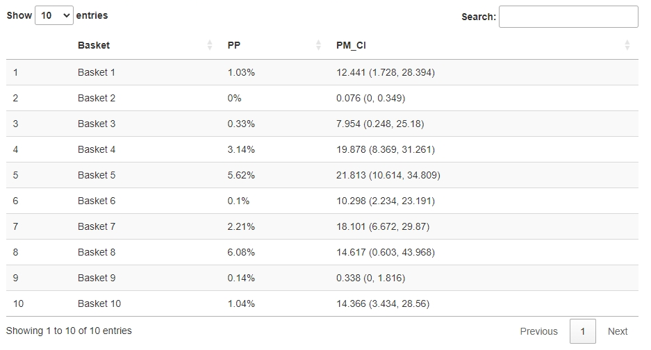

## Introduction

A basket trial in oncology encompasses multiple 'baskets' that simultaneously assess one treatment in multiple cancer types or subtypes. In contrast to most existing methods that use posterior credible intervals to determine the efficacy of the new treatment, RoBoT builds upon a formal Bayesian hypothesis testing framework that leads to interpretable and robust inference using Markov chain Monte Carlo(MCMC) for computation.

## User-provided inputs

For the first two inputs: Number of patients in each group and Number of responses in each group, the software expects comma-separated numbers. The lengths of these inputs should be equal and correspond to the number of baskets you assign.

For the remaining inputs, please provide a single number for each. Ensure the null hypothesis response rate is within the range (0,1).

The number of burn-in iterations specifies the iterations needed for the Markov Chain to reach a stationary distribution. The number of iterations determines how many iterations the MCMC should perform to sample enough data. Generally, using a large number of iterations and an appropriate number of burn-in iterations will improve the final results. We recommend using the default settings for optimal performance.

## Output

A data frame including the **posterior probabilities(PP)** and **posterior means with 95% credible intervals(PM_CI)** of each **Basket** will be generated. PP indicates probability of response rate in this bakset being greater than the pre-specified and fixed historical control response rate(null hypothesis response rate). PM refers to the infered response rate in this basket. You can download the output data frame as a csv file. Due to the nature of MCMC method, the result will show some degree of randomness.

## Example output using default settings

